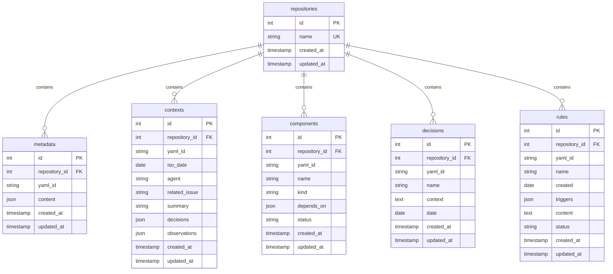

# Advanced Memory Bank MCP Tool

A TypeScript implementation of a distributed YAML memory bank as an MCP (Model Context Protocol) tool, storing memories in a database with repository filtering capabilities. Fully compliant with MCP specification for seamless integration with IDEs and AI agents.

## Features

- **Thread-Safe Singleton Pattern** - Ensures each resource is instantiated only once, with proper thread safety
- **Distributed YAML Structure** - Follows the advanced memory bank specification
- **Repository Filtering** - All operations can be filtered by repository name
- **Asynchronous Operations** - Uses async/await for better performance
- **Both API & CLI** - Access via REST API or command line
- **Multiple Database Support** - Works with SQLite (default) or PostgreSQL
- **Fully MCP Compliant** - All tools follow the Model Context Protocol for IDE integration
- **Modular Tool Structure** - Each tool is defined in its own module for better maintainability
- **MCP/JSON-RPC Communication** - Supports both HTTP and stdio communication for versatile integration

## Installation

```bash
# Clone the repository
git clone https://github.com/solita-internal/advanced-memory-tool-mcp
cd advanced-memory-tool-mcp

# Install dependencies
npm install

# Build the project
npm run build

# Run database migrations
npm run migrate
```

## Configuration

Create a `.env` file in the root directory with the following variables:

```env
# Database Configuration
DB_CLIENT=sqlite3                  # or 'pg' for PostgreSQL
DB_FILENAME=./memory-bank.sqlite   # SQLite only

# For PostgreSQL (uncomment if needed)
# DB_HOST=localhost
# DB_PORT=5432
# DB_USER=postgres
# DB_PASSWORD=your_password
# DB_NAME=memory_bank

# Server Configuration
PORT=3000
HOST=localhost
```

## Usage

### Starting the Server

```bash
npm start
```

## MCP Server Implementation

This project implements the Model Context Protocol specification with three server types:

### HTTP Server

The standard server that exposes MCP endpoints over HTTP, ideal for web-based integrations.

```bash
# Start the HTTP server
npm start
```

### HTTP Streaming Server

Implements the MCP protocol with HTTP streaming support following the TypeScript SDK approach. Enables real-time feedback and progressive results.

```bash
# Start the HTTP streaming server
npx ts-node src/mcp-httpstream-server.ts
```

The HTTP streaming server provides:

- Standard MCP endpoints (`initialize`, `tools/list`, etc.)
- Non-streaming endpoints at `/tools/:toolName`
- Streaming endpoints at `/tools/:toolName/stream`
- Server-sent events with progress updates during tool execution
- Event types: `start`, `progress`, `result`, and `error`

### stdio Server

A stdio-based implementation that follows JSON-RPC 2.0 for direct integration with AI tools and IDEs:

```bash
# Start the stdio server directly
npx ts-node src/mcp-stdio-server.ts
```

All server implementations support these MCP endpoints:

- `initialize` - Protocol handshake and capability discovery
- `tools/list` - Discovery of available tools with full schema definitions
- `resources/list` - Resource listing (if applicable)
- `resources/templates/list` - Resource template listing (if applicable)

### Debug Logging

The MCP stdio server includes a comprehensive debug logging system:

```env
# Set debug level in .env or as environment variable
DEBUG=0   # Minimum logging (errors only)
DEBUG=1   # Basic operation logging
DEBUG=2   # Verbose with request/response details
DEBUG=3   # Full data logging (development only)
```

### Using with Coding IDEs

You can use this MCP server as a provider in f.ex. [Windsurf](https://github.com/windsurf-ai/windsurf), the open-source AI coding agent platform.

#### 1. Register the MCP Server with this configuration

In your IDE, add this MCP server configuration to your workspace or global MCP config file:

```json
{
  "mcpServers": {
    "advanced-memory-bank-mcp": {
      "command": "npx",
      "args": [
        "-y",
        "ts-node",
        "/absolute_path/to/advanced-memory-tool/src/mcp-stdio-server.ts"
      ],
      "env": {
        "PORT": "3000",
        "DB_CLIENT": "sqlite3",
        "DB_FILENAME": "./memory-bank.sqlite",
        "DEBUG": "0"
      },
      "transportType": "stdio"
    }
  }
}
```

- The `command` and `args` fields tell IDE how to start your MCP server process.
- The `env` block configures environment variables for your server.
- Adjust the `args` if your entry point is different (e.g., `dist/server.js` after build).

For more details, see the documentation of the IDE you use.

#### 2. Use MCP Server with the IDE

Once registered, the coding Agent can:

- Query memories: `<IDE> memory list --server advanced-memory-bank-mcp`
- Add new context, components, decisions, or rules via IDE's UI or CLI
- Automatically integrate the memory bank into your agent workflows using the rules available in the repository.

### 3. Environment Variables

Ensure your `.env` is configured for your database and server settings. Example:

```env
DB_CLIENT=sqlite3
DB_FILENAME=./memory-bank.sqlite
PORT=3000
HOST=localhost
```

### 4. Using the CLI

The advanced-memory-bank-mcp tool provides a command-line interface for all operations:

```bash
# Initialize a memory bank for a repository
npm run cli init my-repo

# Export memory bank to YAML files
npm run cli export my-repo -o ./exported-memory

# Import memory bank from YAML files
npm run cli import my-repo ./some-file.yaml

# Add to today's context
npm run cli add-context my-repo -a "agent-name" -s "Summary" -d "New decision" -o "Observation"

# Add a component
npm run cli add-component my-repo comp-AuthService -n "AuthService" -k "service" -d "lib-JwtVerifier"

# Add a decision
npm run cli add-decision my-repo dec-20250510-pattern -n "Decision Name" -d "2025-05-10" -c "Context info"

# Add a rule
npm run cli add-rule my-repo rule-logging-v1 -n "Logging Rule" -c "2025-05-10" -t "trigger1,trigger2" -o "Rule content"
```

### 5. Using the API

The advanced-memory-bank-mcp tool provides a REST API for all operations:

#### Initialize a Memory Bank

```http
POST /api/memory/repositories/:repository/init
```

#### Metadata Operations

```http
GET /api/memory/repositories/:repository/metadata
PUT /api/memory/repositories/:repository/metadata
```

#### Context Operations

```http
GET /api/memory/repositories/:repository/contexts/today
PUT /api/memory/repositories/:repository/contexts/today
GET /api/memory/repositories/:repository/contexts
```

#### Component Operations

```http
PUT /api/memory/repositories/:repository/components/:id
GET /api/memory/repositories/:repository/components
```

#### Decision Operations

```http
PUT /api/memory/repositories/:repository/decisions/:id
GET /api/memory/repositories/:repository/decisions?startDate=YYYY-MM-DD&endDate=YYYY-MM-DD
```

#### Rule Operations

```http
PUT /api/memory/repositories/:repository/rules/:id
GET /api/memory/repositories/:repository/rules
```

#### Export/Import Operations

```http
GET /api/memory/repositories/:repository/export
POST /api/memory/repositories/:repository/import
```

### 6. Architecture

This project follows a clean architecture with separation of concerns:

### 7. Database Layer

Uses Knex.js to provide a database-agnostic interface with support for:

- SQLite (default for simplicity)
- PostgreSQL (for production environments)

### 8. Repository Layer

Thread-safe singleton repositories for each memory type:

- RepositoryRepository
- MetadataRepository
- ContextRepository
- ComponentRepository
- DecisionRepository
- RuleRepository

### 9. Service Layer

- MemoryService - Core business logic for memory operations
- YamlService - Serialization/deserialization of YAML content

### 10. API Layer

Express-based REST API with validation using Zod

### 11. Database Schema

The Memory Bank system uses a relational database with the following structure:



### Schema Design

The database schema follows these design principles:

1. **Repository-centric structure** - All memory items belong to a repository
2. **YAML-ID indexing** - Each memory item has a unique YAML ID within its repository
3. **JSON content storage** - Complex structures are stored as JSON
4. **Timestamped entities** - All records track creation and update times
5. **Type-safe access** - The schema uses appropriate data types for each field

### MCP Layer

- **Tool Definitions** - Modular tool definitions with full MCP schema compatibility
- **Server Implementations** - Both HTTP, HTTPStream and stdio-based servers for different integration types
- **Protocol Compliance** - Full support for the MCP specification including resources and tools endpoints

### CLI Layer

Commander-based CLI with async operation support

## MCP Tool Structure

The MCP tools are organized in a modular directory structure:

```text
src/mcp/
├── types/
│   └── index.ts           # MCP shared types
├── tools/
│   ├── index.ts           # Re-exports all tools
│   ├── init-memory.ts     # Init memory bank tool
│   ├── metadata-tools.ts  # get-metadata & update-metadata
│   ├── context-tools.ts   # get-context & update-context
│   ├── component-tool.ts  # add-component
│   ├── decision-tool.ts   # add-decision
│   ├── rule-tool.ts       # add-rule
│   └── import-export.ts   # export-memory-bank & import-memory-bank
└── index.ts               # Main entry point
```

## License

MIT

## Contributing

Please read the contributing guidelines before submitting a pull request.

## Table Schema Definitions

This section provides detailed information about the database tables used in the Memory Bank system.

### Table: repositories

The central table that stores information about each repository.

| Column | Type | Constraints | Description |
| ------ | ---- | ----------- | ----------- |
| id | INTEGER | PRIMARY KEY | Unique identifier for the repository |
| name | TEXT | NOT NULL, UNIQUE | Name of the repository |
| created_at | TIMESTAMP | DEFAULT NOW() | When the repository was created |
| updated_at | TIMESTAMP | DEFAULT NOW() | When the repository was last updated |

### Table: metadata

Stores metadata information associated with repositories.

| Column | Type | Constraints | Description |
| ------ | ---- | ----------- | ----------- |
| id | INTEGER | PRIMARY KEY | Unique identifier for the metadata |
| repository_id | INTEGER | NOT NULL, FOREIGN KEY | Reference to the repository |
| yaml_id | TEXT | NOT NULL | Identifier in the YAML structure |
| content | JSON | NOT NULL | Structured metadata content |
| created_at | TIMESTAMP | DEFAULT NOW() | When the metadata was created |
| updated_at | TIMESTAMP | DEFAULT NOW() | When the metadata was last updated |

Unique constraint: (repository_id, yaml_id)

### Table: contexts

Stores context information, typically associated with a specific date.

| Column | Type | Constraints | Description |
| ------ | ---- | ----------- | ----------- |
| id | INTEGER | PRIMARY KEY | Unique identifier for the context |
| repository_id | INTEGER | NOT NULL, FOREIGN KEY | Reference to the repository |
| yaml_id | TEXT | NOT NULL | Identifier in the YAML structure |
| iso_date | DATE | NOT NULL | Date associated with the context |
| agent | TEXT | NULL | Agent that generated the context |
| related_issue | TEXT | NULL | Issue reference related to the context |
| summary | TEXT | NULL | Summary of the context |
| decisions | JSON | NULL | Array of decisions made |
| observations | JSON | NULL | Array of observations made |
| created_at | TIMESTAMP | DEFAULT NOW() | When the context was created |
| updated_at | TIMESTAMP | DEFAULT NOW() | When the context was last updated |

Unique constraint: (repository_id, yaml_id)
Index: iso_date

### Table: components

Stores architectural component information.

| Column | Type | Constraints | Description |
| ------ | ---- | ----------- | ----------- |
| id | INTEGER | PRIMARY KEY | Unique identifier for the component |
| repository_id | INTEGER | NOT NULL, FOREIGN KEY | Reference to the repository |
| yaml_id | TEXT | NOT NULL | Identifier in the YAML structure |
| name | TEXT | NOT NULL | Name of the component |
| kind | TEXT | NULL | Type/kind of the component |
| depends_on | JSON | NULL | Array of dependencies |
| status | TEXT | DEFAULT 'active' | Status of the component |
| created_at | TIMESTAMP | DEFAULT NOW() | When the component was created |
| updated_at | TIMESTAMP | DEFAULT NOW() | When the component was last updated |

Unique constraint: (repository_id, yaml_id)

### Table: decisions

Stores architectural decision records.

| Column | Type | Constraints | Description |
| ------ | ---- | ----------- | ----------- |
| id | INTEGER | PRIMARY KEY | Unique identifier for the decision |
| repository_id | INTEGER | NOT NULL, FOREIGN KEY | Reference to the repository |
| yaml_id | TEXT | NOT NULL | Identifier in the YAML structure |
| name | TEXT | NOT NULL | Name/title of the decision |
| context | TEXT | NULL | Context surrounding the decision |
| date | DATE | NOT NULL | Date when the decision was made |
| created_at | TIMESTAMP | DEFAULT NOW() | When the decision was created |
| updated_at | TIMESTAMP | DEFAULT NOW() | When the decision was last updated |

Unique constraint: (repository_id, yaml_id)

### Table: rules

Stores agent rules and guidelines.

| Column | Type | Constraints | Description |
| ------ | ---- | ----------- | ----------- |
| id | INTEGER | PRIMARY KEY | Unique identifier for the rule |
| repository_id | INTEGER | NOT NULL, FOREIGN KEY | Reference to the repository |
| yaml_id | TEXT | NOT NULL | Identifier in the YAML structure |
| name | TEXT | NOT NULL | Name/title of the rule |
| created | DATE | NOT NULL | Date when the rule was created |
| triggers | JSON | NULL | Array of events that triggered the rule |
| content | TEXT | NULL | The actual rule content/description |
| status | TEXT | DEFAULT 'active' | Status of the rule |
| created_at | TIMESTAMP | DEFAULT NOW() | When the rule record was created |
| updated_at | TIMESTAMP | DEFAULT NOW() | When the rule record was last updated |

Unique constraint: (repository_id, yaml_id)

### Relationships

- All tables have a foreign key relationship to `repositories(id)` with `ON DELETE CASCADE` behavior
- Each entity type (metadata, context, component, decision, rule) has a unique constraint on `(repository_id, yaml_id)` to prevent duplicates
- The `contexts` table has an additional index on `iso_date` to optimize date-based queries
