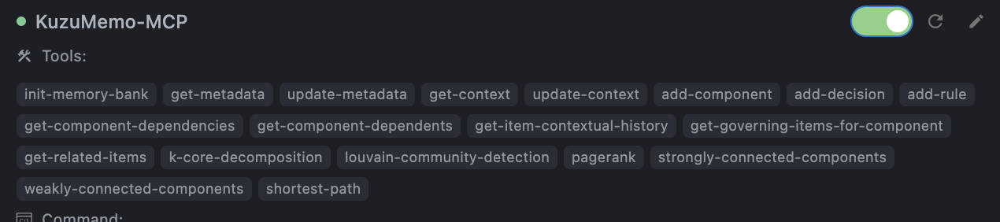

# KuzuMem-MCP

A TypeScript implementation of a distributed memory bank as an MCP (Model Context Protocol) tool, storing memories in a **KùzuDB graph database** with repository and branch filtering capabilities. Branch isolation is achieved by using a graph-unique identifier for entities, enabling a centralized memory bank while allowing repository-specific and branch-specific views. 

**Built with the official MCP TypeScript SDK** for full protocol compliance and seamless integration with IDEs and AI agents.

## Features

- **Official MCP TypeScript SDK** - Built using the official `@modelcontextprotocol/sdk` for guaranteed protocol compliance and access to latest MCP features
- **Thread-Safe Singleton Pattern** - Ensures each resource is instantiated only once, with proper thread safety
- **Distributed Graph Structure** - Follows the advanced memory bank specification using a KùzuDB graph
- **Repository & Branch Awareness** - All operations are contextualized by repository name and branch, with entities uniquely identified by a composite key (`repositoryName:branchName:itemId`)
- **Asynchronous Operations** - Uses async/await for better performance
- **Multiple Access Interfaces** - Access via a RESTful HTTP API, a CLI, and multiple MCP server implementations
- **KùzuDB Backend** - Utilizes KùzuDB for graph-based memory storage and querying
- **Fully MCP Compliant** - All tools follow the Model Context Protocol using official SDK patterns
- **Modular Architecture** - Clear separation between MCP servers, service layer, memory operations, and repositories
- **MCP/JSON-RPC Communication** - Supports:
  - **HTTP Streaming (SSE)** via a unified `/mcp` endpoint for progressive results using official `StreamableHTTPServerTransport` (`src/mcp-httpstream-server.ts`)
  - **Stdio** for direct IDE/Agent integration using official `StdioServerTransport`, supporting both batch and progressive results (`src/mcp-stdio-server.ts`)
  - HTTP with per-tool batch-oriented endpoints (`src/mcp/server.ts` via `src/app.ts` at `/mcp/tools/...`)
- **Official Session Management** - Proper MCP session handling with session IDs for HTTP streaming transport
- **Server-Sent Events (SSE)** - Real-time streaming of tool results and progress notifications using official SDK patterns
- **Progressive Results Streaming** - Supports `tools/progress` notifications for long-running graph operations over Stdio and HTTP Streaming
- **Graph & Traversal Tools** - Includes tools for dependency analysis, pathfinding, and graph algorithms
- **Lazy Database Initialization** - Databases are only initialized when explicitly requested through the init-memory-bank tool, not during server startup
- **Client Project Root Isolation** - Each client project gets its own isolated database instance based on the provided project root path

## Documentation

This README provides basic setup and usage information. For detailed documentation on architecture, advanced usage patterns, and graph database capabilities, please see [Extended Documentation](docs/README2.md) and [Graph Schema](docs/graph-schema.md).
For details on tools supporting progressive results, see [MCP Tools Streaming Support](src/mcp/tools/README.md).

## Installation

```bash
# Clone the repository
git clone https://github.com/solita-internal/kuzumem-mcp
cd kuzumem-mcp

# Install dependencies
npm install

# Build the project
npm run build
```

## Configuration

Create a `.env` file in the root directory with the following variables:

```env
# Database Configuration
# Default filename for KuzuDB database files created within client project roots
DB_FILENAME="memory-bank.kuzu" 

# Server Configuration
# Main server port
PORT=3000
# HTTP Stream server port (should be different from main port)
HTTP_STREAM_PORT=3001
# Host to bind server to
HOST=localhost

# Debug Logging for MCP Servers (0=Error, 1=Warn, 2=Info, 3=Debug, 4=Trace)
DEBUG=1
```

Add the following to your IDEs MCP configuration:

```json
{
  "mcpServers": {
    "KuzuMemo-MCP": {
      "command": "npx",
      "args": [
        "-y",
        "ts-node",
        "/Users/<absolute_path>/src/mcp-stdio-server.ts" // or "src/mcp-httpstream-server.ts" if your IDE supports SSE
      ],
      "env": {
        "PORT": "3000",
        "HOST": "localhost",
        "DB_FILENAME": "memory-bank.kuzu",
        "HTTP_STREAM_PORT": "3001"
      },
      "protocol": "stdio" // or "sse" for HTTP streaming
    }
  }
}
```



## Usage

### Starting the Servers for local testing

- **HTTP Streaming MCP Server (Recommended - Official SDK with SSE):** (`src/mcp-httpstream-server.ts`)

  ```bash
  # Make sure memory-bank directory exists
  mkdir -p ./memory-bank
  
  # Start the HTTP stream server using official MCP SDK
  npx ts-node src/mcp-httpstream-server.ts
  ```

- **stdio MCP Server (Recommended - Official SDK):** (`src/mcp-stdio-server.ts`)

  ```bash
  # The stdio server will detect client project root from the environment
  # or from the tools/call arguments for init-memory-bank
  npx ts-node src/mcp-stdio-server.ts
  ```

- **Main HTTP Server (for REST API & Batch MCP via per-tool endpoints):** (`src/app.ts` which uses `src/mcp/server.ts` for `/mcp/tools/...`)

  ```bash
  # Make sure memory-bank directory exists
  mkdir -p ./memory-bank
  
  # Start the main server
  npm start
  ```

## Database Initialization

After the refactoring, database initialization now works as follows:

1. Databases are explicitly initialized through the `init-memory-bank` tool, not during server startup
2. Each database is stored within the client's project root directory
3. The database path is constructed at runtime by concatenating:
   - The client's project root (provided per request)
   - The database filename (from DB_FILENAME environment variable)
4. Server startup no longer fails if the database directory doesn't exist - it's created on demand

## MCP Server Implementation

All server implementations use the **official MCP TypeScript SDK** and support these MCP capabilities:

- `initialize` - Protocol handshake and capability discovery using official request schemas
- `tools/list` - Discovery of available tools with full schema definitions using `ListToolsRequestSchema`
- `tools/call` - Execution of any listed tool using `CallToolRequestSchema`, with support for `tools/progress` streaming from graph operations
- **Session Management** - Proper MCP session handling with session IDs for HTTP streaming transport
- **Server-Sent Events** - Real-time streaming using official `StreamableHTTPServerTransport`

**Recommended Server Implementations:**

1. **HTTP Streaming Server** (`src/mcp-httpstream-server.ts`) - Uses official `StreamableHTTPServerTransport` with SSE support
2. **stdio Server** (`src/mcp-stdio-server.ts`) - Uses official `StdioServerTransport` for direct IDE integration

**Common Tool Parameters (in JSON request body)**:

- `repository`: string (repository name, e.g., "my-project")
- `branch`: string (optional, defaults to "main"; specifies the branch context for the item)
- `id`: string (the logical/user-defined ID for the item, e.g., "comp-auth", "my-rule-001")
- `clientProjectRoot`: string (required for init-memory-bank, specifies the absolute path to the client project root)

## Architecture

This project follows a clean architecture with separation of concerns and **uses the official MCP TypeScript SDK**:

### Database Layer

- Uses **KùzuDB**, an embedded graph database
- Interaction via the `KuzuDBClient` which executes **Cypher** queries
- Database paths are now constructed at runtime using the client's project root

### Repository Layer

Thread-safe singleton repositories for each memory type and core graph entities:

- `RepositoryRepository` (for `Repository` nodes)
- `MetadataRepository`
- `ContextRepository`
- `ComponentRepository` (also handles component-centric graph queries like dependencies, dependents, related items, shortest path, and placeholders for graph algorithms)
- `DecisionRepository`
- `RuleRepository`

### Memory Operations Layer (`src/services/memory-operations/`)

A new layer introduced to encapsulate specific business logic for groups of operations, called by `MemoryService`.

- `metadata.ops.ts`
- `context.ops.ts`
- `component.ops.ts` (includes new traversal ops)
- `decision.ops.ts`
- `rule.ops.ts`
- `import-export.ops.ts`
- `graph.ops.ts` (for graph algorithms and generic traversals)

### Service Layer

- `MemoryService` - Core business logic, now acts as an orchestrator, delegating to Memory Operations Layer functions
- `RepositoryFactory` - Creates and caches repository instances
- `RepositoryProvider` - Manages repositories per client project root, ensuring proper initialization

### MCP Layer (`src/mcp/`) - **Official SDK Integration**

- **Tool Definitions (`src/mcp/tools/`)**: Modular tool definitions ([see details](src/mcp/tools/README.md)) with full MCP schema compatibility. Includes new graph and traversal tools
- **Tool Handlers (`src/mcp/tool-handlers.ts`)**: Centralized logic for executing any defined MCP tool, shared by different server implementations
- **Streaming Support Infrastructure (`src/mcp/streaming/`, `src/mcp/services/tool-execution.service.ts`)**:
  - `progress-handler.ts`: Defines `ProgressHandler` and `ProgressTransport` interfaces for managing streaming
  - `stdio-transport.ts`: Implements `ProgressTransport` for stdio
  - `http-transport.ts`: Implements `ProgressTransport` for HTTP SSE
  - `tool-execution.service.ts`: Orchestrates tool calls with progress handling
  - `operations/`: Directory containing Operation Classes for streamable tools
- **Server Implementations (Official SDK)**:
  - `src/mcp-httpstream-server.ts`: **Recommended** - Uses official `Server` class with `StreamableHTTPServerTransport` for SSE support
  - `src/mcp-stdio-server.ts`: **Recommended** - Uses official `Server` class with `StdioServerTransport` for direct IDE integration
  - `src/mcp/server.ts` (`MemoryMcpServer`): Legacy Express.js implementation with dedicated batch-oriented POST endpoints per tool
- **Types(`src/mcp/types/`)**: Shared MCP type definitions (e.g., `McpTool`, `ToolHandler`)

### CLI Layer

Commander-based CLI with async operation support, interacting with `MemoryService`.

## KùzuDB Graph Schema

The memory bank uses a graph structure in KùzuDB. Refer to [Graph Schema](docs/graph-schema.md) for the detailed node and relationship definitions.

Key aspects:

- **Nodes**: `Repository`, `Metadata`, `Context`, `Component`, `Decision`, `Rule`
- **Primary Keys**: `Repository` nodes use `id` (format: `name:branch`). Other entities (`Metadata`, `Context`, `Component`, `Decision`, `Rule`) use a `graph_unique_id` (format: `repositoryName:itemBranch:logicalId`) as their `PRIMARY KEY` to ensure uniqueness across repositories and branches. They also store their logical `id` and `branch` as separate properties
- **Relationships**: Various `HAS_...` and semantic relationships like `DEPENDS_ON`, `CONTEXT_OF`, etc., link these nodes

## License

MIT

## Contributing

Feel free to contribute to the project.

## Future Improvements

- **Enhance CLI** to support branch selection for all relevant commands more explicitly
- **Refine Graph Algorithm Streaming**: Further refactor `MemoryService` and Kùzu calls within Operation Classes to provide more granular progress for algorithms where KùzuDB allows iterative result yielding
- **Add Full-Text Search (FTS) Capabilities** - Planned implementation to enable efficient keyword-based search across all memory items using KùzuDB's FTS extension. Especially good when tags are implemented
- **Vector Embeddings Support** - Planned implementation; would enable semantic similarity search and NLP-based memory retrieval using KùzuDB's vector capabilities. Currently blocked due to KuzuDB Vector columns being immutable. Updating memories wouldn't update the vector embeddings. Making the feature a little redundant
- **Graph Schema Evolution** - Extending the graph schema to support more complex memory types and relationships. Filenames, tags etc.

## Target Graph Schema


