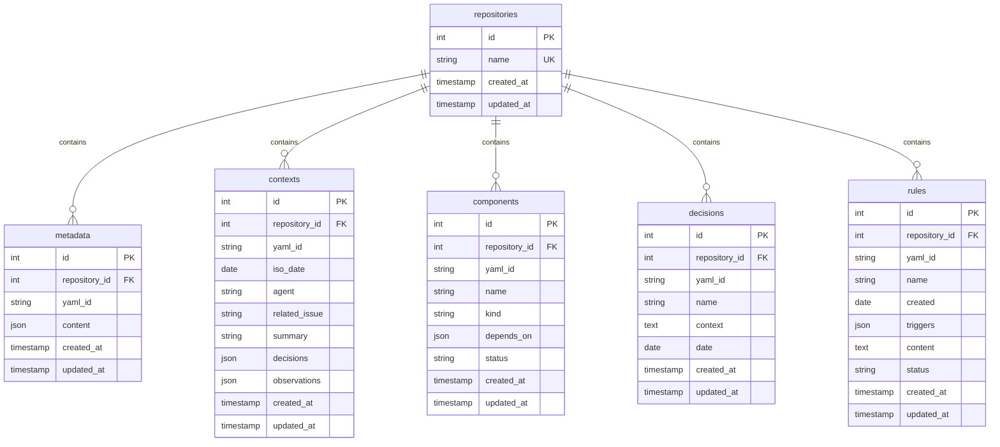

# Advanced Memory Bank MCP Tool

A TypeScript implementation of a distributed YAML memory bank as an MCP (Model Context Protocol) tool, storing memories in a database with repository filtering capabilities. Fully compliant with MCP specification for seamless integration with IDEs and AI agents.

## Features

- **Thread-Safe Singleton Pattern** - Ensures each resource is instantiated only once, with proper thread safety
- **Distributed YAML Structure** - Follows the advanced memory bank specification
- **Repository Filtering** - All operations can be filtered by repository name
- **Asynchronous Operations** - Uses async/await for better performance
- **Both API & CLI** - Access via REST API or command line
- **Multiple Database Support** - Works with SQLite (default) or PostgreSQL
- **Fully MCP Compliant** - All tools follow the Model Context Protocol for IDE integration
- **Modular Tool Structure** - Each tool is defined in its own module for better maintainability
- **MCP/JSON-RPC Communication** - Supports both HTTP and stdio communication for versatile integration

## Installation

```bash
# Clone the repository
git clone <repository-url>
cd memory-bank-mcp

# Install dependencies
npm install

# Build the project
npm run build

# Run database migrations
npm run migrate
```

## Configuration

Create a `.env` file in the root directory with the following variables:

```env
# Database Configuration
DB_CLIENT=sqlite3                  # or 'pg' for PostgreSQL
DB_FILENAME=./memory-bank.sqlite   # SQLite only

# For PostgreSQL (uncomment if needed)
# DB_HOST=localhost
# DB_PORT=5432
# DB_USER=postgres
# DB_PASSWORD=your_password
# DB_NAME=memory_bank

# Server Configuration
PORT=3000
HOST=localhost
```

## Usage

### Starting the Server

```bash
npm start
```

## MCP Server Implementation

This project implements the Model Context Protocol specification with three server types:

### HTTP Server

The standard server that exposes MCP endpoints over HTTP, ideal for web-based integrations.

```bash
# Start the HTTP server
npm start
```

### HTTP Streaming Server

Implements the MCP protocol with HTTP streaming support following the TypeScript SDK approach. Enables real-time feedback and progressive results.

```bash
# Start the HTTP streaming server
npx ts-node src/mcp-httpstream-server.ts
```

The HTTP streaming server provides:

- Standard MCP endpoints (`initialize`, `tools/list`, etc.)
- Non-streaming endpoints at `/tools/:toolName`
- Streaming endpoints at `/tools/:toolName/stream`
- Server-sent events with progress updates during tool execution
- Event types: `start`, `progress`, `result`, and `error`

### stdio Server

A stdio-based implementation that follows JSON-RPC 2.0 for direct integration with AI tools and IDEs:

```bash
# Start the stdio server directly
npx ts-node src/mcp-stdio-server.ts
```

All server implementations support these MCP endpoints:

- `initialize` - Protocol handshake and capability discovery
- `tools/list` - Discovery of available tools with full schema definitions
- `resources/list` - Resource listing (if applicable)
- `resources/templates/list` - Resource template listing (if applicable)

### Debug Logging

The MCP stdio server includes a comprehensive debug logging system:

```env
# Set debug level in .env or as environment variable
DEBUG=0   # Minimum logging (errors only)
DEBUG=1   # Basic operation logging
DEBUG=2   # Verbose with request/response details
DEBUG=3   # Full data logging (development only)
```

### Using with Windsurf

You can use this MCP server as a provider in [Windsurf](https://github.com/windsurf-ai/windsurf), the open-source AI coding agent platform.

#### Prerequisites

- Node.js and npm installed
- Windsurf CLI installed (`npm install -g windsurf`)
- This server running locally or accessible from your Windsurf instance

#### 1. Start the MCP Server

```bash
npm start
```

By default, the server runs on `http://localhost:3000` (configurable via `.env`).

#### 2. Register the MCP Server with Windsurf

In your Windsurf project, register the MCP server as a provider in your configuration file (e.g., `windsurf.json` or `windsurf.config.json`).

Example configuration for a local memory-bank MCP server:

```json
{
  "mcpServers": {
    "memory-bank-mcp": {
      "command": "npx",
      "args": [
        "-y",
        "ts-node",
        "/absolute_path/to/advanced-memory-tool/src/mcp-stdio-server.ts"
      ],
      "env": {
        "PORT": "3000",
        "DB_CLIENT": "sqlite3",
        "DB_FILENAME": "./memory-bank.sqlite",
        "DEBUG": "0"
      },
      "transportType": "stdio"
    }
  }
}
```

- The `command` and `args` fields tell Windsurf how to start your MCP server process.
- The `env` block configures environment variables for your server.
- Adjust the `args` if your entry point is different (e.g., `dist/server.js` after build).

For more details, see the Windsurf documentation.

#### 3. Use Windsurf with the MCP Server

Once registered, you can:

- Query memories: `windsurf memory list --server memory-bank-mcp`
- Add new context, components, decisions, or rules via Windsurf's UI or CLI
- Integrate the memory bank into your agent workflows

#### 4. Environment Variables

Ensure your `.env` is configured for your database and server settings. Example:

```env
DB_CLIENT=sqlite3
DB_FILENAME=./memory-bank.sqlite
PORT=3000
HOST=localhost
```

#### 5. Example Windsurf Command

```bash
windsurf memory list --server memory-bank-mcp --repository my-repo
```

For more details, see [Windsurf documentation](https://github.com/windsurf-ai/windsurf) and the API section below.

### Using the CLI

The memory-bank-mcp tool provides a command-line interface for all operations:

```bash
# Initialize a memory bank for a repository
npm run cli init my-repo

# Export memory bank to YAML files
npm run cli export my-repo -o ./exported-memory

# Import memory bank from YAML files
npm run cli import my-repo ./some-file.yaml

# Add to today's context
npm run cli add-context my-repo -a "agent-name" -s "Summary" -d "New decision" -o "Observation"

# Add a component
npm run cli add-component my-repo comp-AuthService -n "AuthService" -k "service" -d "lib-JwtVerifier"

# Add a decision
npm run cli add-decision my-repo dec-20250510-pattern -n "Decision Name" -d "2025-05-10" -c "Context info"

# Add a rule
npm run cli add-rule my-repo rule-logging-v1 -n "Logging Rule" -c "2025-05-10" -t "trigger1,trigger2" -o "Rule content"
```

### Using the API

The memory-bank-mcp tool provides a REST API for all operations:

#### Initialize a Memory Bank

```http
POST /api/memory/repositories/:repository/init
```

#### Metadata Operations

```http
GET /api/memory/repositories/:repository/metadata
PUT /api/memory/repositories/:repository/metadata
```

#### Context Operations

```http
GET /api/memory/repositories/:repository/contexts/today
PUT /api/memory/repositories/:repository/contexts/today
GET /api/memory/repositories/:repository/contexts
```

#### Component Operations

```http
PUT /api/memory/repositories/:repository/components/:id
GET /api/memory/repositories/:repository/components
```

#### Decision Operations

```http
PUT /api/memory/repositories/:repository/decisions/:id
GET /api/memory/repositories/:repository/decisions?startDate=YYYY-MM-DD&endDate=YYYY-MM-DD
```

#### Rule Operations

```http
PUT /api/memory/repositories/:repository/rules/:id
GET /api/memory/repositories/:repository/rules
```

#### Export/Import Operations

```http
GET /api/memory/repositories/:repository/export
POST /api/memory/repositories/:repository/import
```

## Architecture

This project follows a clean architecture with separation of concerns:

### Database Layer

Uses Knex.js to provide a database-agnostic interface with support for:

- SQLite (default for simplicity)
- PostgreSQL (for production environments)

### Repository Layer

Thread-safe singleton repositories for each memory type:

- RepositoryRepository
- MetadataRepository
- ContextRepository
- ComponentRepository
- DecisionRepository
- RuleRepository

### Service Layer

- MemoryService - Core business logic for memory operations
- YamlService - Serialization/deserialization of YAML content

### API Layer

Express-based REST API with validation using Zod

## Database Schema

The Memory Bank system uses a relational database with the following structure:



### Schema Design

The database schema follows these design principles:

1. **Repository-centric structure** - All memory items belong to a repository
2. **YAML-ID indexing** - Each memory item has a unique YAML ID within its repository
3. **JSON content storage** - Complex structures are stored as JSON
4. **Timestamped entities** - All records track creation and update times
5. **Type-safe access** - The schema uses appropriate data types for each field

### MCP Layer

- **Tool Definitions** - Modular tool definitions with full MCP schema compatibility
- **Server Implementations** - Both HTTP and stdio-based servers for different integration types
- **Protocol Compliance** - Full support for the MCP specification including resources and tools endpoints

### CLI Layer

Commander-based CLI with async operation support

## MCP Tool Structure

The MCP tools are organized in a modular directory structure:

```text
src/mcp/
├── types/
│   └── index.ts           # MCP shared types
├── tools/
│   ├── index.ts           # Re-exports all tools
│   ├── init-memory.ts     # Init memory bank tool
│   ├── metadata-tools.ts  # get-metadata & update-metadata
│   ├── context-tools.ts   # get-context & update-context
│   ├── component-tool.ts  # add-component
│   ├── decision-tool.ts   # add-decision
│   ├── rule-tool.ts       # add-rule
│   └── import-export.ts   # export-memory-bank & import-memory-bank
└── index.ts               # Main entry point
```

## Memory Structure

The memory bank follows this structure:

```text
/   # project root
├── memory/
│   ├── metadata.yaml            # one‑off project metadata
│   ├── context/                 # short‑term notes (rotating)
│   │   └── ctx-<ISO>.yaml
│   ├── graph/                   # durable knowledge graph
│   │   ├── components/
│   │   │   └── comp-*.yaml
│   │   ├── decisions/
│   │   │   └── dec-*.yaml
│   │   └── rules/
│   │       └── rule-*.yaml
│   └── README.md                # how to interact (optional)
└── …
```

## YAML File Schemas

### Metadata

```yaml
--- !Metadata
id: meta
project:
  name: AwesomeApp
  created: 2024-03-12
tech_stack:
  language: TypeScript
  framework: Next.js 15
  datastore: PostgreSQL 16
architecture: modular_monolith
memory_spec_version: 3.0.0
```

### Context

```yaml
--- !Context
id: ctx-2025-04-30T11-42
iso_date: 2025-04-30T11:42:00+03:00
agent: cline
related_issue: 123
summary: Improve auth flow error handling
decisions:
  - Added centralised `handleAuthError()` wrapper.    #promote
observations:
  - External API intermittently returns 429.
```

### Component

```yaml
--- !Component
id: comp-AuthService
name: AuthService
kind: service
depends_on: [lib-JwtVerifier]
status: active
```

### Decision

```yaml
--- !Decision
id: dec-20241201-repo-pattern
name: Adopt Repository Pattern
context: Repository abstraction for testability.
date: 2024-12-01
```

### Rule

```yaml
--- !Rule
id: rule-logging-v1.1.0
name: Centralised Logging Wrapper Required
created: 2025-02-11
triggers:
  - misused logger pattern detected thrice in Sprint 14
content: |
  Every new module must call `core/log.ts#log()`; direct `console.*` calls are banned.
status: active
```

## License

MIT

## Contributing

Please read the contributing guidelines before submitting a pull request.
