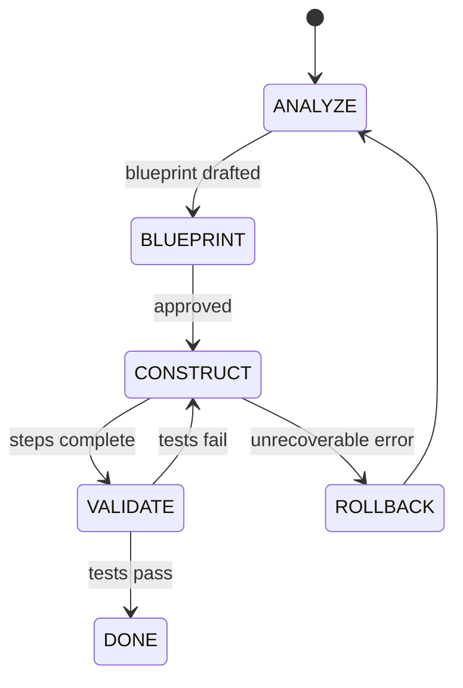

# KuzuMem-MCP

A TypeScript implementation of a distributed memory bank as an MCP (Model Context Protocol) tool, storing memories in a **KùzuDB graph database** with repository and branch filtering capabilities. Branch isolation is achieved by using a graph-unique identifier for entities, enabling a centralized memory bank while allowing repository-specific and branch-specific views. Fully compliant with MCP specification for seamless integration with IDEs and AI agents.

## Key Features

- **Unified Tool Architecture** - 11 consolidated tools covering all memory bank operations
- **Thread-Safe Singleton Pattern** - Ensures each resource is instantiated only once, with proper thread safety
- **Distributed Graph Structure** - Follows the advanced memory bank specification using a KùzuDB graph
- **Repository & Branch Awareness** - All operations are contextualized by repository name and branch
- **Asynchronous Operations** - Uses async/await for better performance
- **Multiple Access Interfaces** - Access via CLI and multiple MCP server implementations
- **KùzuDB Backend** - Utilizes KùzuDB for graph-based memory storage and querying
- **Fully MCP Compliant** - All tools follow the Model Context Protocol for client integration
- **Progressive Results Streaming** - Supports streaming for long-running graph operations
- **Client Project Root Isolation** - Each client project gets its own isolated database instance

## Unified Tools

The system provides 11 unified tools that consolidate all memory bank operations:

1. **memory-bank** - Initialize and manage memory bank metadata
2. **entity** - Create, update, delete, and retrieve all entity types (components, decisions, rules, files, tags)
3. **introspect** - Explore graph schema and metadata
4. **context** - Manage work session context
5. **query** - Unified search across contexts, entities, relationships, dependencies, governance, history, and tags
6. **associate** - Create relationships between entities
7. **analyze** - Run graph algorithms (PageRank, K-Core, Louvain, Shortest Path)
8. **detect** - Detect patterns (strongly/weakly connected components)
9. **bulk-import** - Efficient bulk entity import
10. **search** - Standard search capabilities
11. **semantic-search** - Future semantic search capability (placeholder)

For detailed tool documentation, see [Unified Tools Documentation](docs/unified-tools.md).

## Documentation

- [Extended Documentation](docs/README2.md) - Architecture and advanced usage patterns
- [Graph Schema](docs/graph-schema.md) - Database schema details

## Installation

```bash
# Clone the repository
git clone git@github.com:Jakedismo/KuzuMem-MCP.git
cd kuzumem-mcp

# Install dependencies
npm install

# Build the project
npm run build
```

## Configuration

Create a `.env` file in the root directory:

```env
# Database Configuration
DB_FILENAME="memory-bank.kuzu" 

# Server Configuration
HTTP_STREAM_PORT=3001
HOST=localhost

# Debug Logging (0=Error, 1=Warn, 2=Info, 3=Debug, 4=Trace)
DEBUG=1
```

Add to your IDE's MCP configuration:

```json
{
  "mcpServers": {
    "KuzuMem-MCP": {
      "command": "node",
      "args": [
        "/absolute/path/to/kuzumem-mcp/dist/src/mcp-stdio-server.js" // or "mcp-httpstream-server.js" or "mcp-sse-server.js"
      ],
      "env": {
        "PORT": "3000",
        "HOST": "localhost",
        "DB_FILENAME": "memory-bank.kuzu",
        "HTTP_STREAM_PORT": "3001"
      },
      "protocol": "stdio" // or "httpstream" or "sse"
    }
  }
}
```

## Quick Start

### 1. Initialize Memory Bank

```json
{
  "tool": "memory-bank",
  "operation": "init",
  "clientProjectRoot": "/path/to/your/project",
  "repository": "my-app",
  "branch": "main"
}
```

### 2. Create Entities

```json
{
  "tool": "entity",
  "operation": "create",
  "entityType": "component",
  "repository": "my-app",
  "branch": "main",
  "data": {
    "id": "comp-auth-service",
    "name": "Authentication Service",
    "kind": "service",
    "depends_on": ["comp-user-service"]
  }
}
```

### 3. Query Dependencies

```json
{
  "tool": "query",
  "type": "dependencies",
  "repository": "my-app",
  "branch": "main",
  "componentId": "comp-auth-service",
  "direction": "dependencies"
}
```

### 4. Run Analysis

```json
{
  "tool": "analyze",
  "type": "pagerank",
  "repository": "my-app",
  "branch": "main",
  "projectedGraphName": "component-importance",
  "nodeTableNames": ["Component"],
  "relationshipTableNames": ["DEPENDS_ON"]
}
```

## Testing

```bash
# Run unit tests
npm test

# Run E2E tests
npm run test:e2e

# Run specific E2E test
npm run test:e2e:stdio
npm run test:e2e:httpstream

# Run all tests
npm run test:all
```

**Note**: Some tests may fail due to the recent refactoring, but the project builds successfully and core functionality is operational.

## Architecture

The project follows clean architecture with clear separation of concerns:

- **Database Layer** - KùzuDB embedded graph database
- **Repository Layer** - Thread-safe singletons for each entity type
- **Memory Operations Layer** - Business logic for memory operations (refactored to remove Zod dependencies)
- **Service Layer** - Core orchestration and repository management
- **MCP Layer** - Unified tool definitions, handlers, and server implementations
- **CLI Layer** - Command-line interface

For detailed architecture information, see [Extended Documentation](docs/README2.md).

## Agent Development Loop (Rules-Enforced)

When both the repository-level "Always-Applied Workspace Rules" (`project_config_updated.md`) and the short-term workflow rules (`workflow_state_updated.mdc`) are active, every IDE or AI agent that communicates with **KuzuMem-MCP** must follow the five-phase finite-state loop below. Each transition is observable via the unified `context` tool and is backed by mandatory MCP calls that keep the graph database in sync and governance rules enforced.

1. **ANALYZE** – Pull the latest context, inspect 1-hop neighbourhood, and optionally execute a PageRank analysis. Produce a high-level problem statement.
2. **BLUEPRINT** – Draft a numbered implementation plan and persist it as a `Decision` entity (`status: proposed`, tag `architecture`). Wait for explicit user approval.
3. **CONSTRUCT** – Execute plan steps, apply code edits, and immediately mirror changes through `entity`, `associate`, and `context` tool calls while honouring dependency & tagging rules.
4. **VALIDATE** – Run the full test & linter suite. If green, update the `Decision` to `implemented`; if red, log context and loop back to CONSTRUCT.
5. **ROLLBACK** – Automatically triggered on unrecoverable errors, reverting partial work before returning to ANALYZE.

### Phase Diagram



## License

MIT

## Contributing

Contributions are welcome! Please ensure:

- All tests pass (or create issues for failing tests)
- Code follows the existing style
- New features include tests
- Documentation is updated

## Future Improvements

- **Full-Text Search** - Native keyword-based search using KùzuDB's FTS extension
- **Vector Embeddings** - Semantic similarity search (pending KuzuDB vector column updates)
- **Advanced Graph Algorithms** - Additional analysis capabilities
- **Graph Schema Updates** - Based on how well the automated development loop works, the graph schema may need to be updated to support new features
- **Complete Semantic Search** - Implementation of the semantic-search tool (currently placeholder - KuzuDB Vector Indexes are immutable and would make developing this feature difficult since updating memories wouldn't update the vector indexes)
