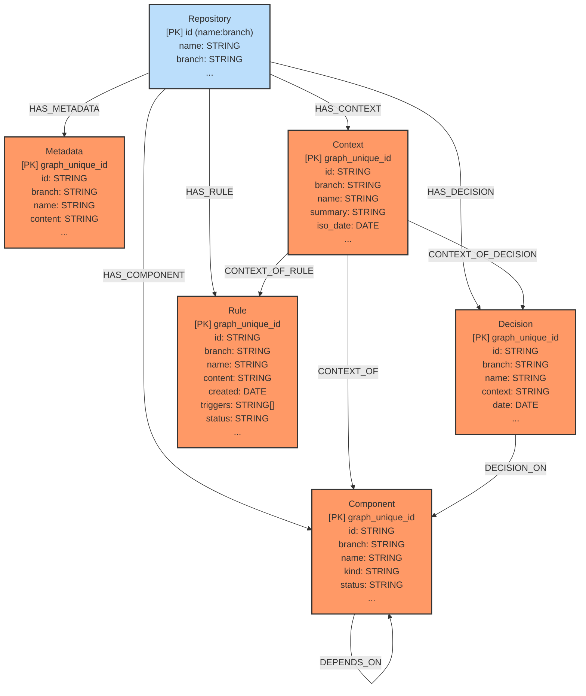

# KuzuDB Graph Schema (Post-Refactor for Branch Awareness)

## Key Concept: Composite Unique IDs

To ensure branch awareness and uniqueness of items (Metadata, Context, Component, Decision, Rule) across different repositories and branches, a `graph_unique_id` is used as the `PRIMARY KEY` for these node tables. This ID is a string constructed programmatically by combining the repository name, the item's specific branch, and the item's logical ID.

Format: `graph_unique_id = "<repository_name>:<item_branch>:<item_id>"`

Each entity also stores its logical `id` (formerly `yaml_id`) and its `branch` as separate properties.

## Node Tables

### Repository

- id: STRING (Primary Key, format: `name:branch`)
- name: STRING
- branch: STRING
- created_at: TIMESTAMP
- updated_at: TIMESTAMP

### Metadata

- graph_unique_id: STRING (Primary Key, format: `repositoryName:branch:id`)
- id: STRING (Logical ID, e.g., "meta")
- name: STRING (Often the repository name)
- content: STRING (JSON string of metadata content)
- branch: STRING (Branch this metadata instance pertains to)
- created_at: TIMESTAMP
- updated_at: TIMESTAMP

### Context

- graph_unique_id: STRING (Primary Key, format: `repositoryName:branch:id`)
- id: STRING (Logical ID, e.g., "context-YYYY-MM-DD")
- name: STRING
- summary: STRING
- iso_date: DATE (The date this context primarily refers to)
- branch: STRING (Branch this context instance pertains to)
- created_at: TIMESTAMP
- updated_at: TIMESTAMP

### Component

- graph_unique_id: STRING (Primary Key, format: `repositoryName:branch:id`)
- id: STRING (Logical ID)
- name: STRING
- kind: STRING
- status: STRING
- branch: STRING (Branch this component instance pertains to)
- created_at: TIMESTAMP
- updated_at: TIMESTAMP

### Decision

- graph_unique_id: STRING (Primary Key, format: `repositoryName:branch:id`)
- id: STRING (Logical ID)
- name: STRING
- context: STRING (Descriptive text, not a link)
- date: DATE (Date of the decision)
- branch: STRING (Branch this decision instance pertains to)
- created_at: TIMESTAMP
- updated_at: TIMESTAMP

### Rule

- graph_unique_id: STRING (Primary Key, format: `repositoryName:branch:id`)
- id: STRING (Logical ID)
- name: STRING
- content: STRING
- created: DATE (Date the rule was defined)
- triggers: STRING[]
- status: STRING
- branch: STRING (Branch this rule instance pertains to)
- created_at: TIMESTAMP
- updated_at: TIMESTAMP

## Mermaid Diagram

## Relationship Tables

- HAS_METADATA (FROM Repository TO Metadata)
- HAS_CONTEXT (FROM Repository TO Context)
- HAS_COMPONENT (FROM Repository TO Component)
- HAS_DECISION (FROM Repository TO Decision)
- HAS_RULE (FROM Repository TO Rule)
- DEPENDS_ON (FROM Component TO Component)
- CONTEXT_OF (FROM Context TO Component)
- CONTEXT_OF_DECISION (FROM Context TO Decision)
- CONTEXT_OF_RULE (FROM Context TO Rule)
- DECISION_ON (FROM Decision TO Component)
