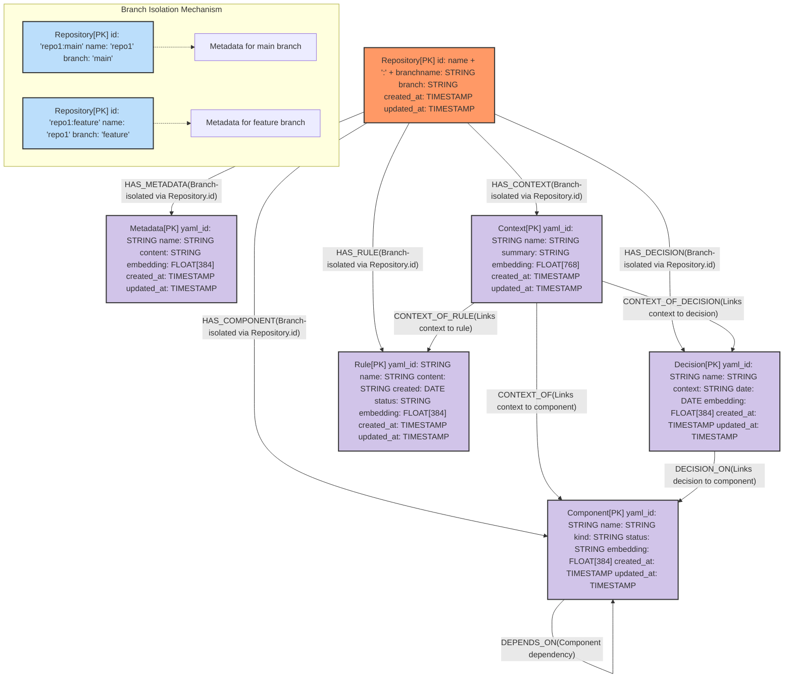

# Vector Embeddings for Semantic Memory Search

This document outlines the implementation plan for incorporating vector embeddings into the Advanced Memory Bank MCP server, enabling natural language-based semantic search across memory items.

## Overview

The current Advanced Memory Bank uses a graph-based approach with KuzuDB to store and retrieve memories. While graph traversal is powerful for relationship-based queries, it lacks the ability to find semantically similar content without exact keyword matches. By adding vector embeddings to our memory items, we can enable semantic search capabilities that understand the meaning behind user queries rather than just matching exact terms.

## KuzuDB Vector Search Extension

KuzuDB provides native support for vector search through its vector extension, which:

1. Allows storing high-dimensional vector embeddings as columns in node tables
2. Supports creating vector indices for efficient similarity search
3. Provides functions for querying the vector indices with customizable distance metrics

The vector extension uses a hierarchical index structure with two layers for efficient search, making it suitable for our memory bank implementation.

> **Note:**
>
> - The vector index is currently **immutable**: if you add or update rows in the table, you must `DROP_VECTOR_INDEX` and `CREATE_VECTOR_INDEX` again to reflect changes.
> - Only one vector column per node table can be indexed at a time.

## Modified Schema

### Current Limitations

The existing schema focuses on graph relationships but lacks:

- Vector embedding fields for semantic content
- Index structures for vector similarity search
- Mechanisms to query memories based on meaning rather than exact traversal

### Schema Modifications

To implement vector search capabilities, we need to update our schema as follows:

#### Node Tables Updates



Key modifications:

1. Added `embedding: FLOAT[768]` field to each memory entity (Metadata, Context, Component, Decision, Rule)
2. The dimension 768 corresponds to the output size of the Alibaba-NLP/gte-modernbert-base model, a highly capable and cost-effective embedding model for large-scale semantic search [[source](https://huggingface.co/blog/billion-classifications)].
3. Added visual indicator in the diagram for nodes with vector embeddings

> **Kùzu Limitation:**
> Each node table can have only one vector column indexed for similarity search. If you need multiple semantic fields, consider concatenating them into a single embedding or using multiple tables.

## Implementation Plan

### Phase 1: Schema and Infrastructure Updates

1. **Update KuzuDB Schema**
   - Modify node table definitions to include vector embedding fields
   - Example for Context table:

     ```sql
     CREATE NODE TABLE Context(
       yaml_id STRING PRIMARY KEY,
       name STRING,
       summary STRING,
       embedding FLOAT[768], /* New field: 768-dim from gte-modernbert-base */
       created_at TIMESTAMP,
       updated_at TIMESTAMP
     );
     ```

2. **Install and Configure Vector Extension**
   - Add installation logic to database initialization:

     ```sql
     INSTALL VECTOR;
     LOAD VECTOR;
     ```

   - Create vector indices for each memory entity type:

     ```sql
     CALL CREATE_VECTOR_INDEX(
       'Context',
       'context_embedding_index',
       'embedding',
       metric := 'cosine'
     );
     /* Repeat for other entity types */
     ```

> **Index Management:**
>
> - To update the index after data changes, run:
>
>   ```cypher
>   CALL DROP_VECTOR_INDEX('Context', 'context_embedding_index');
>   CALL CREATE_VECTOR_INDEX('Context', 'context_embedding_index', 'embedding');
>   ```
>
> - List all indexes:
>
>   ```cypher
>   CALL SHOW_INDEXES() RETURN *;
>   ```

3.**Embedding Generation Service**

- Use [Transformers.js](https://huggingface.co/docs/transformers.js/en/index) for embedding generation.
- Transformers.js supports both single and batch embedding generation, and can run in Node.js or the browser.
- For best performance, use `device: 'webgpu'` to run models on the GPU (if available).
- Example implementation:

     ```typescript
     import { pipeline } from '@xenova/transformers';

     export class EmbeddingService {
       private static instance: EmbeddingService;
       private pipe: any;

       private constructor() {}

       public static async getInstance(): Promise<EmbeddingService> {
         if (!EmbeddingService.instance) {
           EmbeddingService.instance = new EmbeddingService();
           await EmbeddingService.instance.init();
         }
         return EmbeddingService.instance;
       }

       private async init() {
         // Use Alibaba-NLP/gte-modernbert-base for embeddings (768-dim)
         this.pipe = await pipeline('feature-extraction', 'Alibaba-NLP/gte-modernbert-base', {
           device: 'webgpu', // Use WebGPU if available, otherwise fallback to CPU
           dtype: 'q4',      // Use quantized model for performance (optional)
         });
       }

       public async generateEmbedding(text: string): Promise<number[]> {
         const output = await this.pipe(text);
         return output[0];
       }

       public async generateEmbeddings(texts: string[]): Promise<number[][]> {
         const outputs = await Promise.all(texts.map(t => this.pipe(t)));
         return outputs.map(out => out[0]);
       }
     }
     ```

- **Model selection:** The default is `Alibaba-NLP/gte-modernbert-base` (768-dim). You may change to another compatible embedding model if needed.
- **WebGPU:** For best performance, use `device: 'webgpu'`. Fallback to CPU if not available.
- **Quantization:** Use `dtype: 'q4'` for 4-bit quantization (for speed/memory).
- **Batch embedding:** Use `generateEmbeddings` for large-scale or migration jobs to maximize throughput.
- **Model download:** The first time you use a model, it will be downloaded and cached locally.

> **Practical Tip:**
>
> - For large datasets, use batch embedding (parallelize with `Promise.all`).
> - For browser-based apps, ensure the user's browser supports WebGPU for maximum speed.
> - Embedding caching is still recommended for repeated queries.
> - If WebGPU is not available, Transformers.js will automatically fall back to CPU execution.

- For more details, see the [Transformers.js documentation](https://huggingface.co/docs/transformers.js/en/index).

### Phase 2: Service Integration

1. **Update Memory Service**
   - Enhance the MemoryService to generate and store embeddings
   - Example modifications to existing methods:

     ```typescript
     // src/services/memory.service.ts
     
     import { EmbeddingService } from './embedding.service';
     
     export class MemoryService {
       // ... existing code
       
       private embeddingService: EmbeddingService;
       
       async initialize() {
         // ... existing initialization
         this.embeddingService = await EmbeddingService.getInstance();
       }
       
       async addContext(repository: string, branch: string, context: ContextInput): Promise<Context> {
         // Generate embedding for the context summary
         const textForEmbedding = `${context.name} ${context.summary}`;
         const embedding = await this.embeddingService.generateEmbedding(textForEmbedding);
         
         // Include embedding in the database operation
         const query = `
           CREATE (c:Context {
             yaml_id: $yaml_id,
             name: $name,
             summary: $summary,
             embedding: $embedding,
             created_at: datetime(),
             updated_at: datetime()
           })
           RETURN c
         `;
         
         // ... rest of the method
       }
       
       // Update other methods similarly
     }
     ```

2. **Add Vector Search Methods**
   - Implement methods to perform semantic searches
   - Example implementation:

     ```typescript
     // src/services/memory.service.ts
     
     async semanticSearch(
       repository: string, 
       branch: string, 
       query: string, 
       entityTypes: string[] = ['Context', 'Component', 'Decision', 'Rule'], 
       limit: number = 5
     ): Promise<any[]> {
       const queryEmbedding = await this.embeddingService.generateEmbedding(query);
       
       // Aggregate results from all specified entity types
       let allResults = [];
       
       for (const entityType of entityTypes) {
         const indexName = `${entityType.toLowerCase()}_embedding_index`;
         
         const query = `
           MATCH (repo:Repository {id: $repoId})
           CALL QUERY_VECTOR_INDEX(
             '${entityType}',
             '${indexName}',
             $queryEmbedding,
             $limit
           )
           WITH node, distance
           MATCH (repo)-[r]->(node)
           RETURN node, type(r) as relationship, distance
           ORDER BY distance
         `;
         
         const params = {
           repoId: `${repository}:${branch}`,
           queryEmbedding,
           limit
         };
         
         const results = await this.db.executeQuery(query, params);
         allResults = [...allResults, ...results];
       }
       
       // Sort combined results by distance
       return allResults.sort((a, b) => a.distance - b.distance).slice(0, limit);
     }
     ```

> **Result Sorting:**
>
> - The result of `QUERY_VECTOR_INDEX` is **not sorted** by distance unless you explicitly use `ORDER BY distance` in your Cypher query.

### Phase 3: MCP Tool Implementation

1. **Define New MCP Tools**
   - Create tools for semantic search and vector-related operations
   - Example tool definitions:

```typescript
// src/mcp/tools/semantic-search.tool.ts

import { McpTool } from '../types';
import { MemoryService } from '../../services/memory.service';

export const semanticSearchTool: McpTool = {
  name: 'semantic-search',
  description: 'Search memory items semantically using natural language queries',
  parameters: {
    repository: {
      type: 'string',
      description: 'Repository name'
    },
    branch: {
      type: 'string',
      description: 'Repository branch (defaults to main)',
      default: 'main'
    },
    query: {
      type: 'string',
      description: 'Natural language query to find semantically similar memory items'
    },
    entityTypes: {
      type: 'array',
      items: {
        type: 'string',
        enum: ['Context', 'Component', 'Decision', 'Rule', 'Metadata']
      },
      description: 'Types of memory items to search (defaults to all types)',
      default: ['Context', 'Component', 'Decision', 'Rule', 'Metadata']
    },
    limit: {
      type: 'number',
      description: 'Maximum number of results to return',
      default: 5
    }
  },
  handler: async (args, memoryService) => {
    const { repository, branch, query, entityTypes, limit } = args;
    
    try {
      const results = await memoryService.semanticSearch(
        repository,
        branch,
        query,
        entityTypes,
        limit
      );
      
      return {
        query,
        results: results.map(r => ({
          type: r.node.labels[0],
          id: r.node.properties.yaml_id,
          name: r.node.properties.name,
          similarity: 1 - r.distance, // Convert distance to similarity score
          content: r.node.properties.summary || r.node.properties.context || r.node.properties.content
        }))
      };
    } catch (error) {
      return { error: error.message };
    }
  }
};
```

1. **Add More Specialized Vector Tools**

```typescript
// src/mcp/tools/vector-similarity.tool.ts

export const vectorSimilarityTool: McpTool = {
  name: 'vector-similarity',
  description: 'Find similarity between two memory items based on their vector embeddings',
  parameters: {
    repository: {
      type: 'string',
      description: 'Repository name'
    },
    branch: {
      type: 'string',
      description: 'Repository branch (defaults to main)',
      default: 'main'
    },
    itemId1: {
      type: 'string',
      description: 'ID of the first memory item'
    },
    itemType1: {
      type: 'string',
      enum: ['Context', 'Component', 'Decision', 'Rule', 'Metadata'],
      description: 'Type of the first memory item'
    },
    itemId2: {
      type: 'string',
      description: 'ID of the second memory item'
    },
    itemType2: {
      type: 'string',
      enum: ['Context', 'Component', 'Decision', 'Rule', 'Metadata'],
      description: 'Type of the second memory item'
    }
  },
  handler: async (args, memoryService) => {
    // Implementation to calculate similarity between two specific memory items
  }
};
```

```typescript
// src/mcp/tools/hybrid-memory-search.tool.ts

export const hybridMemorySearchTool: McpTool = {
  name: 'hybrid-memory-search',
  description: 'Perform a hybrid search combining vector similarity and graph traversal',
  parameters: {
    repository: {
      type: 'string',
      description: 'Repository name'
    },
    branch: {
      type: 'string',
      description: 'Repository branch (defaults to main)',
      default: 'main'
    },
    query: {
      type: 'string',
      description: 'Natural language query'
    },
    seedEntityType: {
      type: 'string',
      enum: ['Context', 'Component', 'Decision', 'Rule', 'Metadata'],
      description: 'Type of memory item to use as starting point',
      default: 'Context'
    },
    maxHops: {
      type: 'number',
      description: 'Maximum number of relationship hops to traverse',
      default: 2
    },
    limit: {
      type: 'number',
      description: 'Maximum number of results to return',
      default: 10
    }
  },
  handler: async (args, memoryService) => {
    // Implementation for hybrid search combining vector similarity with graph traversal
  }
}

1. **Update CLI Commands**
   - Add commands for vector index management
   - Example new commands:

     ```typescript
     // src/cli/commands/vector.ts
     
     import { Command } from 'commander';
     import { MemoryService } from '../../services/memory.service';
     
     export function registerVectorCommands(program: Command) {
       const vectorCmd = program.command('vector')
         .description('Vector embedding operations');
       
       vectorCmd
         .command('create-indices')
         .description('Create vector indices for all memory entity types')
         .option('-r, --repository <name>', 'Repository name')
         .option('-b, --branch <name>', 'Branch name', 'main')
         .action(async (options) => {
           // Implementation
         });
       
       vectorCmd
         .command('rebuild-embeddings')
         .description('Regenerate embeddings for existing memory items')
         .option('-r, --repository <name>', 'Repository name')
         .option('-b, --branch <name>', 'Branch name', 'main')
         .option('-t, --type <type>', 'Entity type (optional)')
         .action(async (options) => {
           // Implementation
         });
       
       // Additional commands
     }
     ```

2. **API Route Updates**
   - Add endpoints for vector operations
   - Example route implementation:

     ```typescript
     // src/api/routes/vector.ts
     
     import { Router } from 'express';
     import { MemoryService } from '../../services/memory.service';
     
     export function registerVectorRoutes(router: Router) {
       // Get memory service instance
       const memoryService = await MemoryService.getInstance();
       
       router.post('/semantic-search', async (req, res) => {
         const { repository, branch, query, entityTypes, limit } = req.body;
         
         try {
           const results = await memoryService.semanticSearch(
             repository, 
             branch || 'main', 
             query, 
             entityTypes, 
             limit || 5
           );
           
           res.json({ success: true, results });
         } catch (error) {
           res.status(500).json({ success: false, error: error.message });
         }
       });
       
       // Additional routes
     }
     ```

> **Index Management API:**
> - Expose CLI/API commands for dropping and recreating vector indexes, as this will be a common operation when updating memory items.

## Testing Strategy

1. **Unit Tests**
   - Test embedding generation service
   - Test vector similarity calculations
   - Test index creation and management functions

2. **Integration Tests**
   - Test end-to-end workflow from memory creation to semantic search
   - Test hybrid search combining graph traversal and vector similarity
   - Performance testing for different vector dimensions and index configurations

3. **MCP Tool Tests**
   - Test the new MCP tools with various input parameters
   - Test error handling and edge cases

> **Index Immutability:**
> - Add tests to ensure that attempts to update indexed data without dropping/recreating the index are handled gracefully, and that the index is rebuilt as needed.

## Performance Considerations

1. **Embedding Generation**
   - Consider batching embedding generation for multiple items
   - Implement caching to avoid regenerating embeddings for the same text
   - Explore serverless options for scaling intensive embedding computation

2. **Vector Index Configuration**
   - Fine-tune index parameters (metric, hierarchical structure) based on recall/speed tests
   - Consider dimensionality reduction techniques for very large memory banks

3. **Query Optimization**
   - Implement a tiered search approach:
     1. First-pass semantic search to find potential matches
     2. Second-pass graph traversal to find related items
     3. Re-ranking of results based on combined scores

> **Index Parameter Tuning:**
> - Kùzu's HNSW index parameters (`mu`, `ml`, `pu`, `efc`, `metric`) can be tuned for your specific recall/speed requirements.
> - Experiment with these settings and document the chosen configuration for reproducibility.

## Conclusion

Implementing vector embeddings in the Advanced Memory Bank will significantly enhance its capabilities for semantic search and provide AI agents with more intuitive access to stored memories. By combining graph-based relationship traversal with vector-based semantic similarity, we create a powerful hybrid system that understands both the structure and meaning of memory items.

The proposed implementation maintains the existing branch isolation mechanism while adding a new semantic dimension to memory retrieval, making the memory bank more useful for natural language interactions with AI agents.

> **Reference:**
> - [Alibaba-NLP/gte-modernbert-base on Hugging Face](https://huggingface.co/Alibaba-NLP/gte-modernbert-base)
> - [Hugging Face blog: 1 Billion Classifications](https://huggingface.co/blog/billion-classifications)
